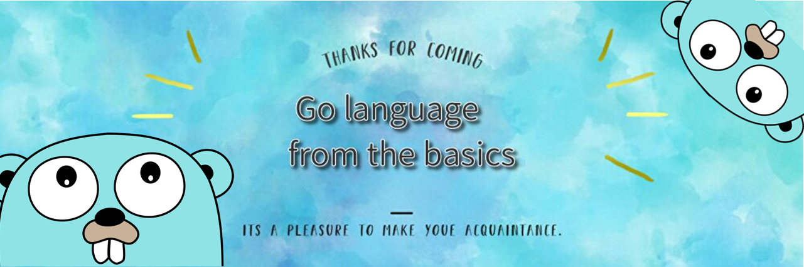

# 基礎からgo言語改定第二版

---

## Install
1. Windowsの場合、公式サイトからインストーラーをダウンロードして実行することでGo言語の環境を構築できる
    - **Featured Download** の　Microsoft Windows を選択してインストーラーをダウンロード

[公式サイト](https://golang.org/dl/)

2. (Skip可)VisualStudioCodeをエディターとして採用する場合は、Extenstionsで**Go**パッケージをインストール。

またVScode上で**ctrl + shift + P** で 
> go install update/tools 

を入力して、全選択してアップデートすると良い

3. c:\\\tempあたりに**hello.go**ファイルを作成して、以下のようなスクリプトを記述する。

```Go
package main

import "fmt"

func main(){
    fmt.Println("Hello World!")
}
```

コマンドラインで次のコマンドを入力

> go run hello.go

コマンドラインに**Hello World!** が表示されれば環境構築完了。

ちなみに、**.exe(実行ファイル)**を作成したい場合はコマンドラインで以下コマンド実行

> go build hello.go
> hello.exe

## Usage

- golangでFizzBazz問題のサンプルコード

```Go
// fizzbuzz.go
// FizzBuzz問題をGO言語で実装するサンプル
package main

import "fmt"

func main() {

	FizzBuzz(1)
	FizzBuzz(3)
	FizzBuzz(5)
	FizzBuzz(9)
	FizzBuzz(10)
	FizzBuzz(13)
	FizzBuzz(15)
	FizzBuzz(30)
	FizzBuzz(50)
	FizzBuzz(100)
	FizzBuzz(101)
}

// int型の引数を一つ受け取るメソッド
func FizzBuzz(input int) {
	if input%15 == 0 {
		fmt.Println("入力値", input, " は「15」の倍数(Fizz Buzz)です")
	} else if input%3 == 0 {
		fmt.Println("入力値", input, " は「3」の倍数(Fizz)です")
	} else if input%5 == 0 {
		fmt.Println("入力値", input, " は「5」の倍数(Buzz)です")
	} else {
		fmt.Println("入力値", input, " は「3,5,15」の倍数ではありません")
	}
}

```
>PS C:\Develop\Go\HelloWorld> go run .\fizzbuzz.go
入力値 1  は「3,5,15」の倍数ではありません
入力値 3  は「3」の倍数(Fizz)です
入力値 5  は「5」の倍数(Buzz)です
入力値 9  は「3」の倍数(Fizz)です
入力値 10  は「5」の倍数(Buzz)です
入力値 13  は「3,5,15」の倍数ではありません
入力値 15  は「15」の倍数(Fizz Buzz)です
入力値 30  は「15」の倍数(Fizz Buzz)です
入力値 50  は「5」の倍数(Buzz)です
入力値 100  は「5」の倍数(Buzz)です
入力値 101  は「3,5,15」の倍数ではありません

## Orgnization

- Chapter2 : Go言語の基礎
    - 基礎文法
    - 型宣言
    - 代入
    - 変数、定数
    - 繰り返し、条件分岐
    - ポインタ

- Chapter3 : 関数とメソッド
    - 関数
    - メソッド
    - 遅延実行

- Chpater4 : 構造体
    - 構造体
    - 構造体の初期化

- Chpater5 : インターフェース
    - インターフェース
    - 型変換

- Chapter6 : 配列、スライス、マップ


- Chapter7 : エラーハンドリング

- Chapter8 : 並列処理

## Version
- Go Version
    - go version go1.12.6 windows/amd64
## Author
pisa